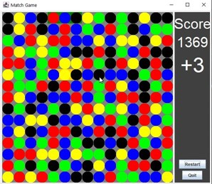

# 1.1 Match 3 Game Clone Overview

**Overview written by Peter Mitchell.**

**Revision Number 1.**

## Contents

```
1.1 Match 3 Game Clone Overview 
1.2 Introduction 
1.3 The Rules of Match 3 Game
1.4 High Level Discussion About Implementation 
1.5 How the Core Game Works 
1.6 How the Rest of the Interface Ties into the Game 
1.7 Features You Could Add 
```
# 1.2 Introduction

This document will explain the fundamentals of how the Match game works.


# 1.3 The Rules of Match 3 Game

You have probably seen many match 3 type games. Games like Bejewelled or Candy Crush. The rules
are very simple for the base game with the focus on matching similar objects or colours together. In
this application it is developed using simple coloured circles. The rules of the game can be summarised
with the following list.

- Starts with a grid of objects that are waiting to be matched.
- Selecting an object on the grid and then one adjacent (up/down/left/right) will swap the two
    cells if it creates a match from at least one moving. Cells do not swap under any other
    conditions.
- A match is considered any connected group of cells either horizontally or vertically where the
    same object appears 3 or more times in a row.
- When cells are matched, they are removed from the board and all cells fall from the top to fill
    the cells that were removed.
- New objects are filled in at the top to fill the gaps at the top after objects have fallen.
- Matches are continually resolved in the same way as described until there are no more
    matches.
- For every matched cell, the player is awarded a score.


# 1.4 High Level Discussion About Implementation

It is certainly possible to add in fancy animations and nice graphics for this sort of game, but that is
not really the focus of this example. Instead, this example is looking at how the matching is done to
facilitate the core game mechanics. This game represents everything on a grid, and everything is
updated in the grid instantly when matches happen. It would be possible to add animation of falling
with a few extra steps that are briefly described in the features you could add section.

The game can be broken down into three separate parts. The core game representing the state
information, the visual form of the state, and finally the parts that tie everything together and add
minor additional content.

Core Game:

- Position: Used to represent positions with an x and y coordinates.
- MatchBoard: Stores the state of the 2d grid and provides methods to update the state of the
    board with all the matching behaviours.

Visual Representation:

- MatchPanel: Uses a MatchBoard and renders it to a panel. Takes the mouse input from the
    user to pass changes to the MatchBoard and changes the game state based on how the input
    is. Meaning it will start by waiting for selecting the first position for a swap, then a second. If
    the pair is a valid pair to swap it will perform the swap, or it will override and return to the
    earlier state. When a swap does occur, it will move to the last state where input is paused
    until all matches have been finished. The states with transitions are shown in the diagram
    below.
	


Other Parts:

- Game: Manages the JFrame, MatchPanel, and StatusPanel providing communication both
    ways via the restart() and notifyScoreUpdate() methods.
- StatusPanel: A panel with JLabels to show the score and buttons to restart and quit.


# 1.5 How the Core Game Works

This section will focus on the MatchBoard and MatchPanel showing how the classes work by breaking
down the functionality that is included. Position will be mostly ignored as it just ties in by representing
a coordinate with x and y so does not warrant additional explanation. Starting with the MatchBoard
that defines most of the core code used to implement the game.

The MatchBoard is simple in how it is designed for the start of the game. The board is just filled with
random numbers in every cell for a given width and height with numbers ranging from 0 to whatever
maxNums has been passed to the class. In this case it will be passed the length of a colours array from
the MatchPanel so that each number will be used to show a colour. The methods defining the
behaviour for the MatchBoard fall into two types. The methods related to all the swapping/matching,
and everything else. Firstly, the methods that fall into the everything else include the following:

- setEnforceAdjacent(): This is not actually used, but it could be called to swap the
    enforceAdjacent variable to false. This would change the rules around swapping to allow the
    MatchBoard to swap any two cells. Note that if you were to implement this the rules would
    need to be added to MatchPanel to make this work as well.
- getCellValue(): Used to grab the int value stored for a given x,y position cell on the grid. Used
    for drawing all the cells.
- fillBoard(): Fills every cell on the board with a random number.

The methods that add in functionality related to the matching include the following methods.

- swapCells(): Does a swap of the values contained in the cells defined by pos1 and pos2. This
    does not check any validation, just does a swap. It is used to perform the actual swap, but also
    for testing if there are any matches in the getMatchesFromSwap() doing a temporary swap.
- getMatchesFromSwap(): Tests what would happen if the two cells defined by pos1 and pos
    were to be swapped. It performs a temporary swap and checks for all the matches, and then
    swaps the cells back. The list of what would change is passed back to be evaluated in the
    MatchPanel. Note that this only does a limited search on the row/columns localised to the
    swap.
- shuffleDownToFill(): Takes a list of all the positions that were marked as matches, moves down
    cells from the top to fill those gaps, and then returns a list of positions that are now empty at
    the top. The list of positions can then be filled in using a fillPositions() call.
- fillPositions(): Fills all the list of positions with new random numbers. This would be called
    normally to fill the cells after a shuffle down has happened.
- findAllMatches(): Searches the entire board on every row and every column for matches.
- getMatchesOnRow(): Searches a single row for all matches of 3 or more in a row and adds
    them to the list of matched elements.
- getMatchesOnColumn(): Does the same as getMatchesOnRow() except it searches a single
    column.
- shuffleDownToFill(): An alternate version of shuffleDownToFill that takes a single position and
    moves all the cells above that point down. This is called by the other version of
    shuffleDownToFill() that takes the list of points.
- getAffectedPositionsFromAffectedColumns(): Converts counts of how many cells were moved
    down for each column into positions at the top of each column. Used by the list version of
    shuffleDownToFill().

As you can see from reading through the list of methods all the functionality for getting the
information needed for matches and performing the result of matching are provided in the
MatchBoard class. It does not facilitate the actual interaction or selecting of points though. That all
happens inside the MatchPanel. The MatchPanel translates the MatchBoards grid of numbers
providing a set of colours that match 1 to 1 with the numbers. For example, 0 is blue, 1 is black, etc.
The MatchPanel controls the MatchBoard by performing the selection of positions and directing it to
perform the correct set of actions.

When the MatchPanel is created it will start itself with a MatchBoard that is fully randomised. You
could make it begin matching right away at the start of the game with a few simple changes, but for
the purpose of this version a stable board state is enforced before the player sees this. It means all
matches are replaced with new random numbers until there is no longer any match on the board. This
may take a few iterations, but it means the player starts with an action right away. A mouse listener
is set to begin listening to change between states from selecting cells and the event timer for flowing
through multiple stages of matching is configured, but not started. The remaining parts will split up
the methods used to create the MatchPanel into similar types. Firstly, the methods used to draw the
game, and then the methods used to provide interaction.

- paint(): Draws first the recently matched and recently filled from top cells marked with
    rectangles to create a visual cue and then draws all cells over the top. Additionally, as a helpful
    visual a + sign is drawn over the cell where pos1 has been set.
- drawAllCells(): Iterates through all the cells in the grid and uses the int values stored in those
    cells to look up the appropriate colour to draw a circle with from the colours array. This is
    done for the individual cells by calling drawCell().
- drawCell(): Does the individual part of the above where it sets the colour correctly and then
    fills in an oval to represent the element visually.
- drawRecentMatches(): As part of the code there is tracked a set of positions where recent
    matches occurred and where recent new cells were randomly added at the top. The most
    recent of these are given a filled rectangle behind them to indicate visually where changes are
    happening. This helps because there is no animation.
- drawSelectedPos1(): Draws a white + sign over the cell where pos1 is set. Used to make it
    stand out more, so the player knows they have set the first of two.
- drawGrid(): Not used, but will draw a grid of lines between all the cells.

The rest of the methods provide functional changes based on the interaction stemming either from
the mouse clicks, or the restart button.

- mouseClicked(): This is the key method to how the game is changing between states. It will
    attempt to move between states by selecting a pos1 and pos2 for swapping cells. Once two
    valid cells are selected they are tested for swapping with attemptCellSwap(). Every time this
    method possibly made a change it will force a repaint() as well.
- restart(): Called from the Game object via the StatusPanel’s Restart button. It will reset the
    game state to a new stable board and reset the score.
- setPos1(): Sets the value of the pos1 to be used for swapping and then changes to the next
    state (choosing pos2).
- setPos2(): Sets the value of the pos1 to be used for swapping and then changes to the next
    state (pause for destroy).


- attemptCellSwap(): uses the getMatchesFromSwap() method in MatchBoard to first check if
    there are any matches. Then updates the score based on matches found. If there were any
    matches the actual swap is performed and then cells are shuffled down to fill the gaps before
    filling the positions at the top by using the different methods in MatchBoard. The matches
    and cells filled at the top are stored to be draw with drawRecentMatches().
- updateScore(): Increases score by an amount and then passes the new score to the
    StatusPanel via the Game object using notifyScoreUpdate().
- isValidPosition(): Checks if the mouse click position is a valid set of coordinates within the
    board.
- createStableBoardState(): Brute forces finding matches, then filling those matched positions
    with new random numbers until there are no more matches.
- configureTimer(): This method actually contains a method inside it. Most of the code is about
    setting up the actionPerformed to be nested inside the Timer. This method sets up the timer
    to trigger every 500ms and it will continue making itself repeat until there are no more
    matches. It will search the entire board for matches and do the same process of shuffling and
    filling as was done inside the mouseClicked() method.

There are a few other methods all related to the mouse that you will find down the bottom, but they
were not important for this application.

You can view the next example that follows as an animation at:

https://i.gyazo.com/2476cecb41f6e7109d8e6b6765ccb710.mp4

Each step of the matches is shown and described for this example.

 

Above to the left you can see the mouse hovering over the yellow circle near the middle. The player
in this example clicks the yellow circle and the blue circle to the left of it. This creates the 3 yellow in
a row. You can see a slight orange background in the image on the right showing where the match
occurred. And you will notice the cells moved down such that the red have now lined up to be a group
of 4 on a row (and also a group of 4 black near the middle, and 3 black near the top). With also the
green background at the top behind the yellow, black, yellow where the new random ones were filled
in.

 

You can see in the next step in the above left image that the two groups of 4 (red/black) and one of 3
(black) were matched and everything fell down then extras filled in at the top. This formed another
group of 3 matching as green near the middle. That is then matched on the right and you can see it
creates another row of 3 matched black. That then leaves the image below where there are no
matches, so it waits for more input.



# 1.6 How the Rest of the Interface Ties into the Game

Most of the functionality has been covered for the application now. The parts that remain are just the
Game class and StatusPanel. The Game class was mostly responsible for just creating the JFrame and
placing the MatchPanel and StatusPanel inside it. It only has two methods that allow a line of
communicate between the MatchPanel and StatusPanel as listed below.

- notifyScoreUpdate(): Called when the score has increased by some amount. The new total
    score and the amount that it has changed are passed through this method to the StatusPanel
    from the MatchPanel.
- restart(): Called when the restart button is pressed in the StatusPanel, this tells the
    StatusPanel to reset its score, and for the MatchPanel to preform its restart which includes
    creating a freshly filled board.

The StatusPanel is there to provide buttons for restarting/quitting the game, and to show the score.
It contains two labels, one to show the current total score, and one to show how much the score was
increased by from the last match that occurred. The methods that can be found in the StatusPanel
include the following.

- updateScore(): Takes the score that has been passed from the MatchPanel to the Game class
    and then down to this StatusPanel. It will swap out the values of the labels. If the amount of
    change in the score is 0 it will just remove the text showing how much the last match gave.
- actionPerformed(): Called when either button is pressed. It checks the button that was
    pressed and handles it appropriately. If it was the restart button it will call restart() in Game
    or if it was the quit button it will just exit the program.

# 1.7 Features You Could Add

The following list shows some of the features or changes you could make to improve this base game.

- Improve visuals: Currently the visuals are very plain with just simple colours. You could swap
    the circles out for images and even perhaps mimic those used in other titles like Bejewelled
    with jewels or candy as in Candy Crush.
- Animate the cells falling: You could take the list of positions changed and add another timer
    for animation. You could transition the cells with an offset travelling between two points over
    a fixed period (should be less than or equal to the time between match checks).
- Add sounds: Every time you get a match a sound (or perhaps additional visual explosion) could
    go off.
- Add in special cells that can be used to apply special effects: For example, cells that when
    matched they clear out an entire column, row, or some area around where the match
    occurred.
- Animate the score panel’s change in score: Make it more eye catching for larger gains in score
    and perhaps you could change it to show multiple increases (perhaps last 3) and have them
    fade out over time.
- You could look at any of the other features in similar types of games and try to mimic them
    yourself.
- Come up with your own new feature or rule change to make the game more unique.


